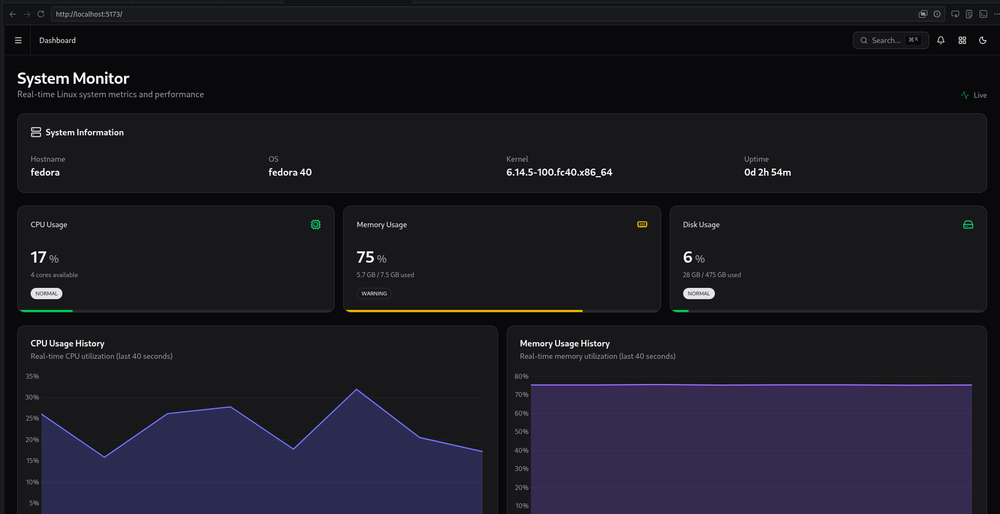
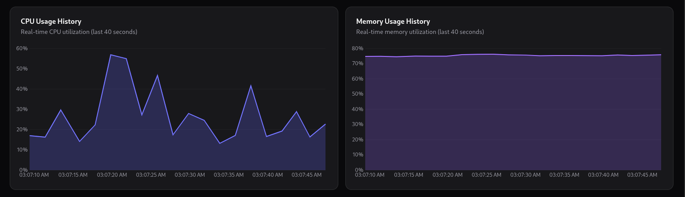

# Horizon 
## Monitoring dashboard untuk sistem linux

Real-time Linux system monitoring dashboard dengan GO backend dan svelte
---

## Requirements 

**Backend**
- Go 1.25 (karena menggunakan framework gin)
- Gin Web Framework
- gopsutil (system metrics)

**UI/client**
- sveltekit
- TailwindCSS
- LayerChart 
- Shadcn-Svelte 

---
## Get Started

### 1. Go Setup 
> Make sure you're already installed go minimum 1.25 or above

```bash
cd backend
go mod init horizon
go get -u github.com/gin-gonic/gin
go get -u github.com/shirou/gopsutil/v3

# Run the server
go run main.go
```
The API will run in `http://localhost:8080`

### 2. Frontend Installation (Svelte)

```bash
cd frontend 
pnpm install 

#Develompent mode
pnpm dev
```

Frontend views will on URL `http://localhost:5173`

## API Endpoints

- `GET /health` - Health check
- `GET /api/system` - System information
- `GET /api/cpu` - CPU metrics
- `GET /api/memory` - Memory metrics
- `GET /api/disk` - Disk metrics
- `GET /api/metrics` - All metrics (combined)

## Development

Backend dan frontend harus running bersamaan:

1. Terminal 1: `cd backend && go run main.go`
2. Terminal 2: `cd frontend && pnpm dev`
3. Buka browser: `http://localhost:5173`

----

## Features

✅ Real-time CPU monitoring
✅ Real-time Memory monitoring
✅ Real-time Disk monitoring
✅ System information display
✅ Historical charts (40 seconds)
✅ Auto-refresh setiap 2 detik
✅ Dark mode support

* Note : program ini belum diuji/ditest apabila dijalankan di windows
---

- Program dari go akan dicompile menjadi sebuah program/binary program yang akan dijalankan di mesin linux (dapat berjalan di background sebagai service). Karena program berjalan langsung pada sistem operasi linux maka program memiliki akses ke resource komputer(file program)

- untuk melihat penggunaan RAM maka program akan mengakses resource komputer via file /proc/meminfo pada sistem linux

- untuk melihat beban CPU via /proc/stat

- untuk melihat beban suhu dari desktop maka membaca file dari /sys/class/thermal

---
## Example

### Cara Kerja Sistem

---
### Dashboard 

---
### Cpu Usage 


