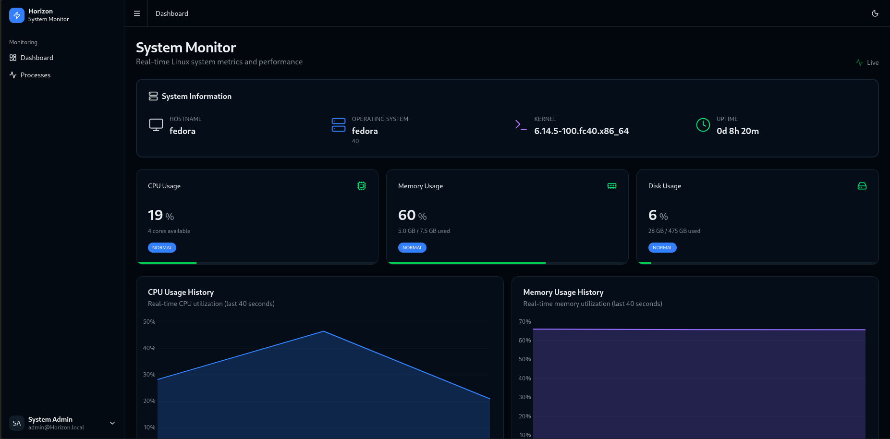
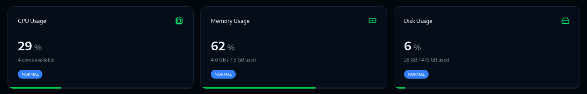
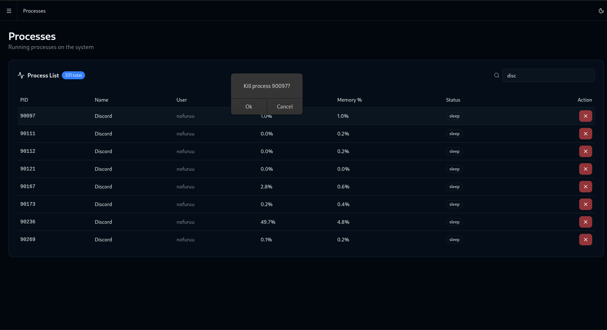
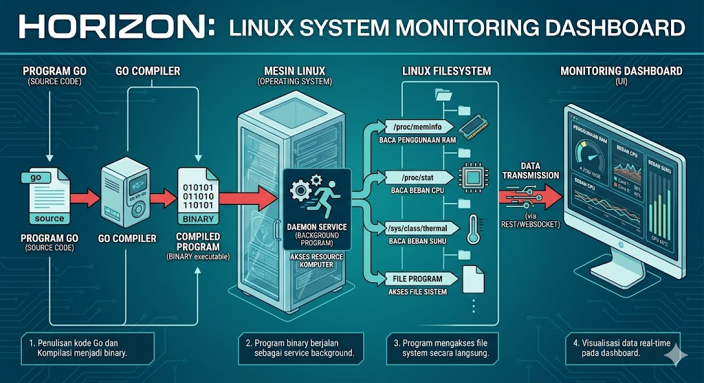

# Horizon 

Real-time Linux system monitoring dashboard with Go backend and Svelte

----

| Dashboard | CPU Usage |
|---|---|
|  |  |

| Process Termination | System Info |
|---|---|
|  |  |

## Requirements 

 **Backend** 
* Go 1.25 (because it uses the Gin framework)
* Gin Web Framework
* gopsutil (system metrics)

 **UI/client** 
* sveltekit
* TailwindCSS
* LayerChart 
* Shadcn-Svelte 

---

## Get Started

> this installation is newer version(if you find any bugs just report into email nfatihulx@gmail.com)

1. **Install dependencies:** 

```bash
    ./install.sh
```

2. **Start the application:** 

```bash
   ./start.sh
```

3. **Open your browser:** 
   - Dashboard: http://localhost:5173 (To see Interface)
   - API: http://localhost:8080 (To see api endpoints)
   - CTRL + C to stop both api and interface
--- 

### Troubleshooting 

1. If you do not have Go installed and see **"command not found go"**, install Go using your Linux distribution package manager.

   - Minimum required version: **Go 1.25**
   - If your package manager installs a newer version automatically, do not add extra version flags.

   Examples:

   1. Fedora / RHEL / CentOS:

```bash
sudo dnf install go
```

   2. Arch Linux / CachyOS / Manjaro:

```bash
sudo pacman -S go
```

   3. Debian / Ubuntu / Linux Mint:

```bash
sudo apt update
sudo apt install golang-go
```

   4. openSUSE:

```bash
sudo zypper install go
```

   5. Generic Debian-based or Ubuntu-based systems:

```bash
sudo apt install golang-go
```

   After installation, verify the version:

```bash
go version
```

   Make sure the output shows **Go 1.25** or newer.


   **"command not found: pnpm"**
   ```bash
   npm install -g pnpm
   ```
